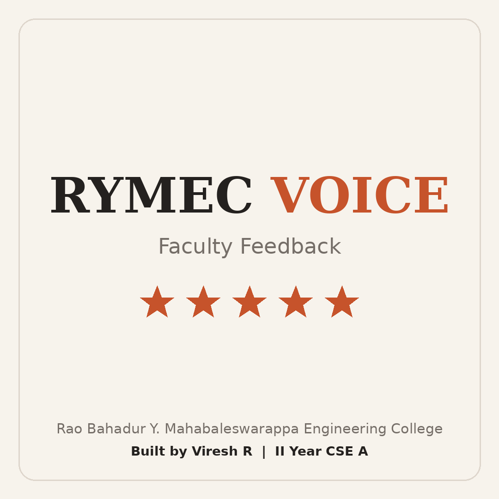

<p align="center">
  
</p>

<h1 align="center">RYMEC Voice</h1>
<p align="center"><b>Student Feedback Website</b><br>Rao Bahadur Y. Mahabaleswarappa Engineering College</p>

<p align="center">
  <a href="https://rymec-voice.vercel.app/"><b>Live site</b></a> ·
  <a href="https://github.com/veereshr4446/Faculty-portal-page">Faculty portal repo</a>
</p>

---

## About

RYMEC Voice lets students give structured feedback about their teachers from a phone in about two minutes. No login or app is needed. Each response is saved against the teacher's unique Faculty ID, so the teacher can see their own results in the companion faculty portal.

## Features

- **Mobile-first design** with large buttons, readable text and no horizontal scrolling
- **Simple 4-step flow:** your details, faculty, subject, rating and comment
- **USN or roll number:** 1st-year students without a USN can use a section letter and number (for example `A52`)
- **Faculty by department:** pick a department, then the faculty member
- **Subject name** typed by the student, with suggestions from earlier entries
- **10-star rating** where every score has a meaning, from 1 (Very Poor) to 10 (Outstanding)
- **Comment box** with a 500-character limit and live counter
- **Hide my name from faculty** option
- **Repeat-review rule:** the same teacher and subject can be reviewed again only after 30 days
- **Clear validation and error messages**, including a friendly message when offline

## How it works

1. The student enters name, USN or roll number, semester and branch.
2. They choose a department and then the faculty member.
3. They type the subject, give a star rating and write a comment.
4. The page sends the feedback to a Google Apps Script backend, which saves it in a Google Sheet.

## Privacy

- If the student ticks **Hide my name from faculty**, teachers see "Anonymous" and no USN.
- The name and USN are still saved for the system administrator. This lets spam or abuse be traced, and the form says so.
- The site stores nothing about the student in the browser beyond the form itself.

## Tech stack

| Part | Technology |
|---|---|
| Frontend | HTML, CSS, vanilla JavaScript |
| Backend | Google Apps Script (private, not in this repo) |
| Database | Google Sheets |
| Hosting | Vercel (free) |

## Project structure

```
Student-feedback-page/
├── index.html      Page structure
├── style.css       Design (ivory, terracotta, charcoal)
├── app.js          Form logic and API calls
└── screenshots/    README images
```

## Run it locally

```bash
git clone https://github.com/veereshr4446/Student-feedback-page.git
cd Student-feedback-page
python -m http.server 8000
```

Open `http://localhost:8000`. The first line of `app.js` holds the backend address:

```js
const API = 'YOUR_APPS_SCRIPT_WEB_APP_URL';
```

Replace it with your own Google Apps Script Web app URL. The backend code is kept private for security, so without it the form loads but cannot fetch faculty or submit.

## Deploy

1. Import the repo into [Vercel](https://vercel.com).
2. Set the preset to **Other** and leave the build settings empty.
3. Deploy.

## Author

**Viresh R**, II Year CSE A, RYMEC

© 2026 RYMEC Voice. All rights reserved.
